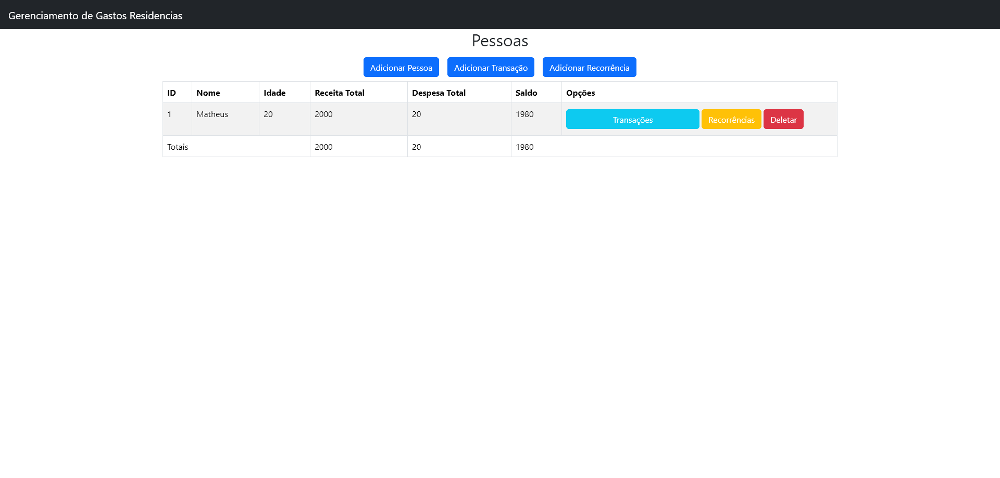
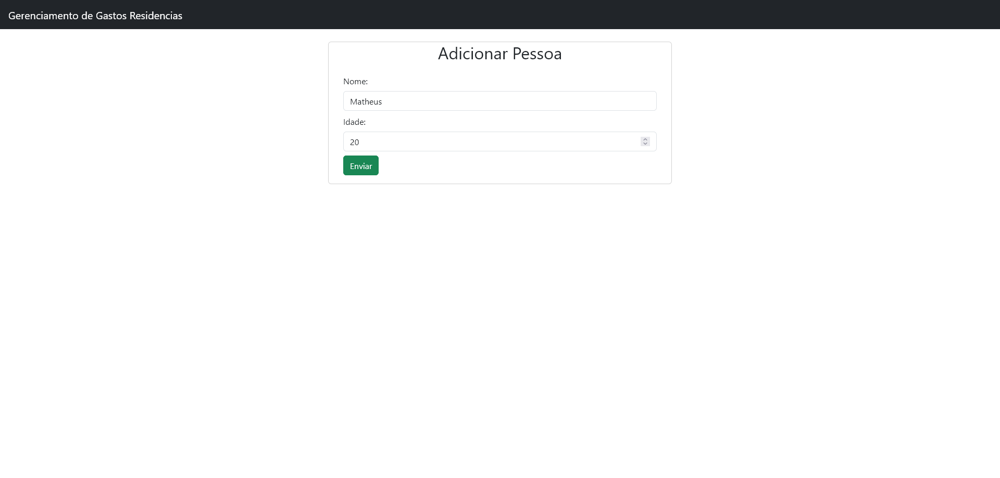
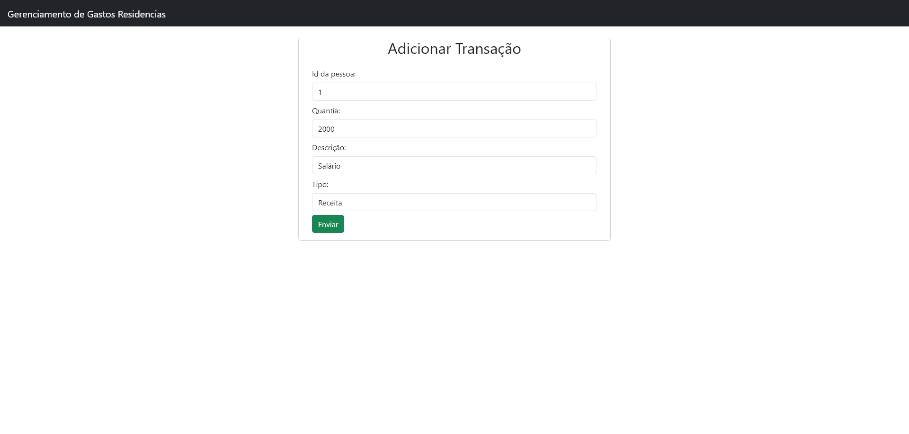
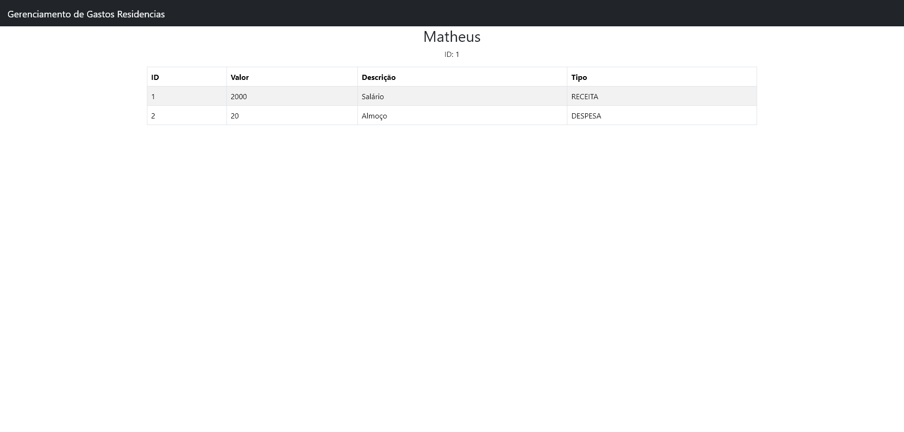
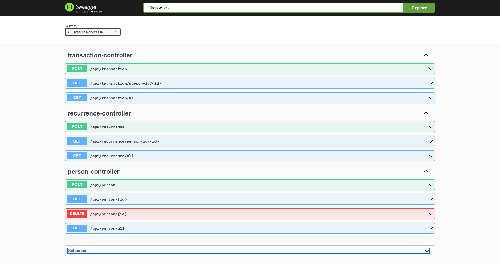

# Residential Expenses Manager

## About

This is a simple application for managing household expenses.  
It allows you to:

- Add and remove users.
- Add **income transactions** for users who are over 18.
- Add **expense transactions** for all users.
- View the **total income, total expenses, and net balance** on the main interface.

The main purpose of this project is to test the integration between a React-based frontend and a Spring Boot Java backend.

> ⚠️ The application uses an in-memory database, so **data will not persist** between restarts.


# Running the Project

To run the project, follow these steps:

## Frontend

1. Open a terminal in the `frontend` folder.
2. Run the following command:

    ```bash
    npm install
    ```

    To install dependencies.

3. Then, run:

    ```bash
    npm run dev
    ```

    To start the frontend server.  
    **Note:** Make sure Node.js and npm are installed.

## Backend

1. Open a terminal in the `backend` folder.
2. Run the following command:

    ```bash
    gradlew bootRun
    ```

    To start the backend server.  
    **Note:** Gradle must be configured in the system's environment variables.  
    **Also:** JDK 21 is required.

## Accessing the App

- Frontend: [http://localhost:3000/persons](http://localhost:3000/persons)  
- API documentation via Swagger: [http://localhost:8080/swagger-ui/index.html](http://localhost:8080/swagger-ui/index.html)

---

GitHub repository: [https://github.com/oMaDaSa/gastosResidenciais](https://github.com/oMaDaSa/gastosResidenciais)


### Screenshots

#### 🏠 Home Dashboard

Overview of all users with their total income, expenses, and balance.



---

#### ➕ Add Person

Modal for adding a new user with name and age.



---

#### 💸 Add Transaction

Form to add a transaction (either income or expense) for a selected user.



---

#### 📄 User Transactions

Displays the list of transactions for a specific user.



---

#### 📚 API Documentation (Swagger)

Interactive API documentation auto-generated by Swagger.


